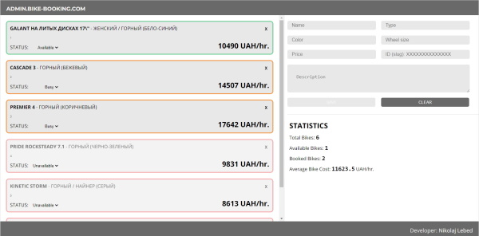

# ADMIN-PANEL FOR A BICYCLE BOOKING APPLICATION (FRONT-END)

## Description

By means of this application you can manage bicycle accounting for your bicycle booking services.

You can test id deployed by [the next link](http://iNikolas.github.io/admin-panel-for-bicycle-booking-service).

#### You can add bicycles with the next fields:

* bicycle name;
* bicycle type;
* color of the bicycle;
* bicycle price (by default in UAH);
* bicycle unique id;
* short description of the bicycle.

#### The bicycle data can only be submitted after all form inputs have valid content, namely:

* all aforementioned fields are required;
* minimum string length for name, type, color and description inputs is 5 characters;
* bicycle id  should be unique and don’t coincide with already added bicycles to the list;
* if the price value has more than two symbols after the comma - it will be automatically truncated for a proper price representation.

All bicycles you have added will be displayed at the main application panel at the left side of its window with provided data. 

#### By means of the main panel you can use the next application features as:

* change bicycle status (available, busy, unavailable);
* remove bicycle from the list (be careful with it, you can’t retrieve deleted data).

#### In addition admin-panel possesses simple statistic features, calculating for you the next data:

* total amount of bikes;
* available and booked bikes respectively;
* average bike cost.

## Installation

This project was bootstrapped with [Create React App](https://github.com/facebook/create-react-app).

You can learn more in the [Create React App documentation](https://facebook.github.io/create-react-app/docs/getting-started).

## Usage

#### Form validation
For the form validation have been chosen react-final-form state management which is considered one of the better solutions in this field. To modify or add validators check /src/components/Fields/validators directory.

You can add composed validators directly to each Field component in the /src/components/BicycleAdd/BicycleAdd.jsx file in validate attribute.

#### Modification some UI elements
To modify header name simply provide a new “headerText” prop attribute for the Header component in the App.js.

To modify author name do almost the same: provide a new “developerName” prop attribute for the Footer component in the App.js.

#### Data storage and embedding backend API
By default the application stores data locally by means of the localForage library. It can be accessible after browser restart or OS reload. But this storage is bound to the origin (domain/protocol/port triplet). That is, different protocols or subdomains infer different storage objects, they can’t access data from each other. 

To embed a proper backed solution just modify API methods in the /src/API/localForage.js file. 
